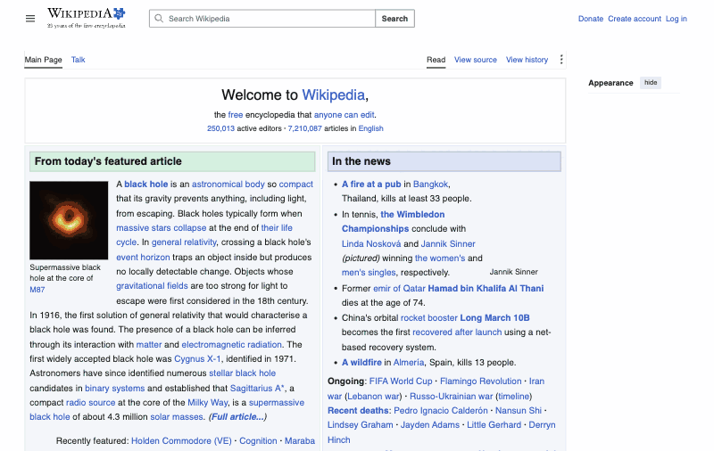
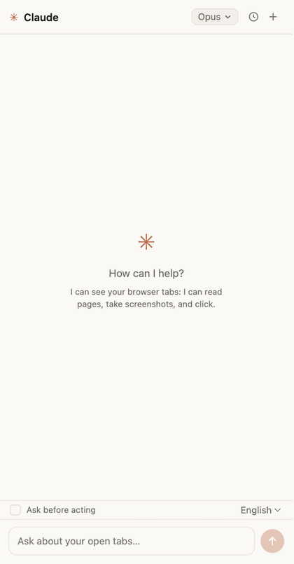

#  Chromium Bridge

[Русская версия](README.ru.md)

A bridge between your Chromium-based browser and Claude Code. The official
"Claude in Chrome" extension connects in some Chromium browsers (Arc, Vivaldi,
and others) but automation hangs: its tools are built on the tab groups API,
which is missing or broken there. This bridge uses only plain
`chrome.tabs` / `chrome.scripting` / `chrome.debugger`, so it works in any
Chromium browser that can load an extension.

## Demo

Claude driving the browser through the bridge — opening Wikipedia, typing a
search, and landing on the article:



## Architecture

```
Claude Code ⇄ (stdio MCP) ⇄ server/index.mjs ⇄ (WebSocket, 127.0.0.1:8929) ⇄ extension in the browser
                                   ⇅ (WebSocket /chat)
                            chat panel (popup on the extension icon)
```

- `extension/` — an MV3 extension: the service worker keeps a WebSocket to the
  local server and executes its commands (tabs, navigation, page text,
  screenshots, clicks, form filling). Clicking the icon opens the chat panel
  (`chat.html`) — a popup anchored to the extension icon.
- `server/` — an MCP server (stdio) that exposes the `browser_*` tools to
  Claude Code and proxies them to the extension. It accepts WS connections
  only from a `chrome-extension://…` Origin — regular web pages cannot connect.
  It also serves the `/chat` channel: panel messages run through the
  Claude Agent SDK (authenticated via the Claude Code login) with the same
  `browser_*` tools; built-in tools (Bash, Read, etc.) are disabled.

## Chat panel

An equivalent of the "Claude in Chrome" side panel: a popup that opens when you
click the extension icon (no `chrome.sidePanel` — it is not supported
everywhere). The chat can see the browser: list tabs, read pages, take
screenshots, and click.



The panel UI is in English by default and switches to Russian automatically
when the browser UI language is Russian. A language selector (Auto / English /
Русский) in the bottom bar overrides auto-detection; the on-page badge follows
the same choice.

- The popup closes when it loses focus (clicking the page) — that is browser
  behavior. The conversation context is not lost: the panel remembers the
  session_id and the server resumes the conversation via the Agent SDK
  `resume`. A turn that is in flight when the popup closes is interrupted.
- It only works while the server is running (usually an active Claude Code
  session with the `chromium-bridge` MCP); otherwise the panel shows
  "Server unavailable".
- Model picker in the panel header: "Default" takes the model from
  `~/.claude/settings.json` (whatever was set via `/model`; SDK sessions do not
  read Claude Code settings themselves, the server passes the model
  explicitly), the other entries are hard overrides. Switching applies on the
  fly (`setModel`) and is remembered. Startup override:
  `CHROMIUM_BRIDGE_CHAT_MODEL=sonnet` in the server environment.
  Port: `CHROMIUM_BRIDGE_PORT` (8929 by default) — server side only; the
  extension always connects to 8929, so changing the port also means editing
  `WS_URL` in `extension/sw.js` and `extension/chat.js`.
- Chat history: the 🕓 button in the header lists past conversations (stored
  in the panel's localStorage, the last 30).
- After each turn there is a usage line: turn tokens (↑ input incl. cache /
  ↓ output) and the accumulated session cost in $ (on a subscription this is
  an estimate, not a separate bill).
- Screenshots the agent takes along the way are shown right in the chat feed
  (click to expand). They are not saved to history (localStorage is finite).
- You can paste images from the clipboard (Cmd+V in the input, up to 5 per
  message) — the model sees them; only a marker remains in history.
- "Ask before acting" mode (checkbox above the input): reading (tabs, text,
  screenshots, console, network) proceeds without questions, while mutating
  actions — clicks/typing/navigation/JS/forms/closing tabs/file uploads —
  wait for an Allow / Deny card. The agent sees a denial and continues the
  conversation. Toggling applies immediately, without recreating the session
  (via the Agent SDK's canUseTool).

## On-page indication

When Claude acts on a tab (from the panel or from Claude Code):

- an orange glow burns around the page edges with a "✳ Claude is working…"
  badge, fading 2.5s after the last action;
- a virtual cursor (an orange arrow) glides to the action point and pulses a
  ring on click; it disappears after 3.5s of inactivity.

Both are hidden on screenshots so they don't end up in the frame and confuse
the model when working with coordinates. On pages where scripts cannot be
injected (`chrome://` and the like) the indication is silently skipped.

## Installation

1. **Extension**: clone this repository, open `chrome://extensions` (in the
   right space/profile!), enable "Developer mode", click "Load unpacked", and
   pick the `extension/` folder.
2. **MCP server** — either way:
   - via npm: `claude mcp add -s user chromium-bridge -- npx chromium-bridge`
   - from the clone: `cd server && npm install`, then
     `claude mcp add -s user chromium-bridge -- node "$(pwd)/index.mjs"`.

   It loads at session start — restart your Claude Code session after
   installing the extension.

   For other MCP clients, add this to your config:

   ```json
   {
     "mcpServers": {
       "chromium-bridge": {
         "command": "npx",
         "args": ["chromium-bridge"]
       }
     }
   }
   ```
3. Check: the `browser_status` tool should return `{"connected": true}`.

## Tools

_As of v0.5._

| Tool | What it does |
|---|---|
| `browser_status` | Check the connection to the extension |
| `browser_tabs_list` | List tabs (id, title, URL) |
| `browser_tab_create` / `browser_tab_close` | Open / close a tab |
| `browser_navigate` | Navigate to a URL; `back`/`forward` for history |
| `browser_page_text` | Page title, URL, and visible text |
| `browser_computer` | Mouse/keyboard/screenshots via CDP: clicks by coordinates or ref, drag, hover, type, key combos, scroll, zoomed region screenshot, wait |
| `browser_read_page` | Accessibility tree with ref ids (filter=interactive) |
| `browser_find` | Find elements by text/role, returns refs |
| `browser_form_input` | Set input/textarea/select/checkbox/contenteditable value by selector or ref |
| `browser_click` | DOM click by CSS selector (plain .click()) |
| `browser_upload_file` | Put files into an `<input type="file">` |
| `browser_javascript` | Run JS on the page (await supported) |
| `browser_console_messages` | Tab console (with a regex filter) |
| `browser_network_requests` | Tab network requests (with a regex filter) |
| `browser_resize_window` | Window size |
| `browser_gif_start` / `browser_gif_stop` | Record a GIF of the tab → file; on long recordings the frame rate halves automatically, so the whole scenario fits |

Everything except basic tab operations works through `chrome.debugger` (CDP):
screenshots don't require activating the tab, clicks are real mouse events,
and console/network are collected from the first CDP touch of the tab.

## Limitations

- The extension lives in one browser profile — install it in the one you want
  to automate.
- While the server is running, its periodic ping keeps the extension's service
  worker awake. If the worker is asleep anyway (e.g. the server has just
  started), a keepalive alarm wakes it within ~30 seconds, and the server waits
  up to 12 seconds for reconnection before erroring.
- Trust model: the WS server listens on 127.0.0.1 and rejects connections
  whose Origin is not `chrome-extension://…`, which keeps web pages out. It
  does not distinguish between extensions, and a non-browser local process can
  fake the Origin header — anything running as your user is trusted, like with
  most local dev tools. Don't run the bridge on a shared machine.
- On the first CDP action the browser shows a "Chromium Bridge started
  debugging this browser" bar — that's normal, the debugger is the control
  mechanism. Closing the bar detaches the debugger (the next action
  re-attaches it).
- Console/network are not recorded retroactively — only after the tab is
  first touched.
- Port 8929 is owned by one session: a second parallel Claude Code session
  cannot start its own WS server (the extension stays with the first one).

## License

[MIT](LICENSE)
